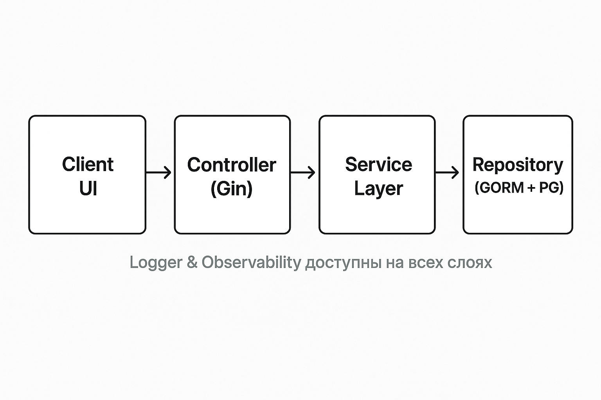
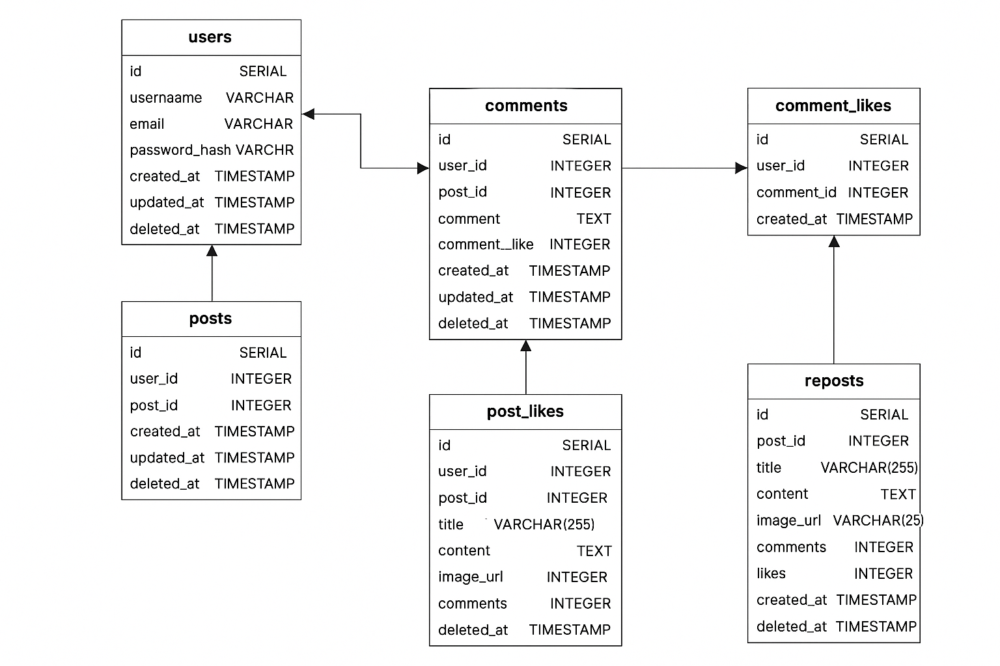

# Mini Blog API

**Mini Blog** — современное REST API для мини-блога с социальным функционалом. Проект построен на принципах чистой архитектуры, легко расширяется и сопровождается.

---

## 🚀 Функционал

- Регистрация и аутентификация пользователей (JWT)
- CRUD для постов, комментариев, репостов
- Лайки постов и комментариев (toggle)
- Загрузка изображений
- Поиск по постам
- Пагинация
- Проверки безопасности (только свой контент)
- Структурированное логирование (JSON, 4 уровня)
- Проверка кода линтером (golangci-lint)
- Покрытие кода unit-тестами
- Настроен CI для автоматической проверки
- Локальный запуск через Docker Compose
- Документация OpenAPI (swagger)

---

## 🏗️ Архитектура проекта



---

## ⚙️ Конфиг и секреты

- **Конфиг приложения** — через [Viper](https://github.com/spf13/viper), файлы в папке `config/` (например, `config.yaml`).
- **Секреты** (пароли, ключи) — только через переменные окружения (`.env`, export ...), не хранятся в git.
- Все параметры (DB, JWT, порты, storage и др.) централизованы.

---

## 🗄️ Схема БД (основные сущности)



---

## 🛠️ Технологический стек

- Go 1.22+
- Gin (REST API)
- GORM (ORM)
- PostgreSQL
- Viper (конфиг)
- JWT (аутентификация)
- Zerolog (логирование)
- Docker Compose (инфраструктура)

---

## 📁 Структура проекта

```
mini-blog/
├── main.go
├── internal/
│   ├── controller/
│   ├── service/
│   └── repository/
├── pkg/
│   ├── logger/
│   └── password/
├── config/
├── entity/
├── mocks/
│
```

---

## 📝 Тесты и линтинг

- Unit-тесты для сервисов и репозиториев (см. internal/service/*_test.go)
- Для запуска тестов с покрытием:
  ```sh
  make test
  ```
- Для проверки кода линтером (golangci-lint):
  ```sh
  make lint
  ```

## ▶️ Быстрый старт (Get Started)

1. **Клонируйте репозиторий:**
   ```sh
   git clone <repo-url>
   cd mini-blog
   ```
2. **Запустите инфраструктуру:**
   ```sh
   make up
   ```
3. **Запустите приложение:**
   ```sh
   make run
   # или go run main.go
   ```
4. **Проверьте код линтером (рекомендуется):**
   ```sh
   make lint
   ```
5. **Swagger/OpenAPI:**

- Вы можете воспользоваться одним из способов:
  1. **Через расширение для vs code**  
     Установите расширение [Swagger Viewer](https://marketplace.visualstudio.com/items?itemName=Arjun.swagger-viewer) (или аналогичное для вашего редактора/браузера) и откройте файл `openapi.yaml` прямо у себя локально.
  2. **Через онлайн Swagger Editor**  
     Откройте [Swagger Editor](https://editor.swagger.io/), скопируйте содержимое файла `openapi.yaml` и вставьте его в редактор для просмотра и тестирования API.

---

## ❓ FAQ и советы

- Все настройки — через Viper и env, не забудьте .env!
- Swagger можно добавить через swaggo/gin-swagger.
- Для CI/CD — легко интегрируется с Github Actions.

---

## Покрытие тестами

- Ключевые бизнес-логики (service, controller, repository, pkg) покрыты тестами на 70-100%

```
mini-blog/config                        coverage: 77.8% of statements
mini-blog/internal/controller           coverage: 92.7% of statements
mini-blog/internal/controller/auth/v1   coverage: 76.5% of statements
mini-blog/internal/controller/rest/v1   coverage: 71.7% of statements
mini-blog/internal/repository/gorm      coverage: 94.0% of statements
mini-blog/internal/service              coverage: 77.8% of statements
mini-blog/pkg/logger                    coverage: 81.8% of statements
mini-blog/pkg/password                  coverage: 83.3% of statements
```
---

**Автор:** [Bekhruz Juraev]  
**Контакты**
Почта: juraevbehruz05@gmail.com
Telegram: https://t.me/bekhruzjur
